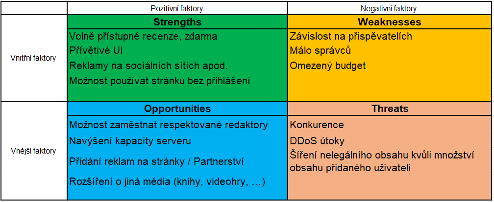
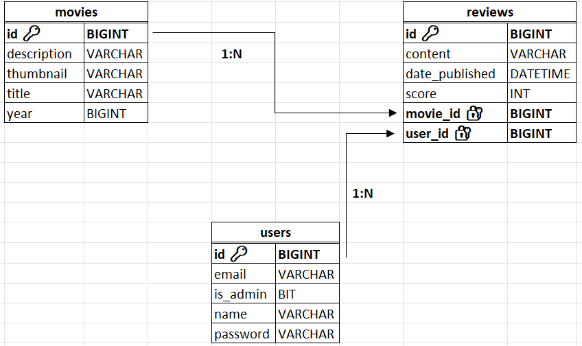
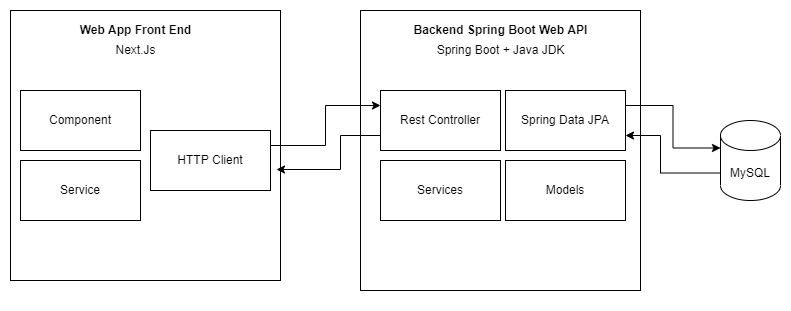
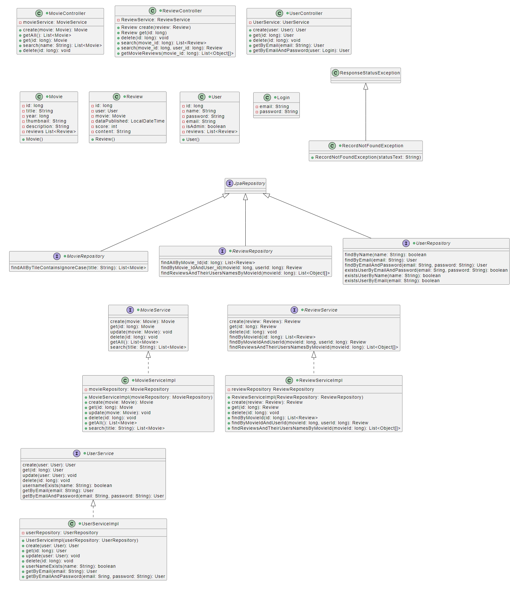
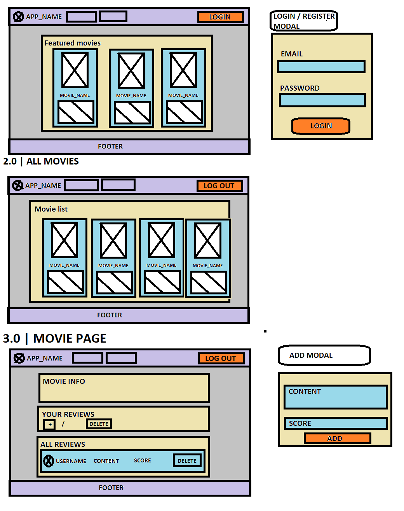

# 7SWI1 SEMESTRÁLNÍ PRÁCE (2023)

--Téma: webová aplikace na které monou uživatelé dávat recenze s komentářem a hodnocením

--Přihlášený uživatel (user) může recenzovat film pouze jednou. A pokud by chtěl změnit recenzi, tak pozmění staré score a text k recenzi nebo případně ji smaže. (Manipuluje maximálně se svojí recenzí)

-- Nepříhlášený uživatel může zobrazit recenze, ale nemůžu je bez přihlášení přidávat nebo jinak s nima minipulovat.

-- Backend: Spring Boot REST

-- frontend: Next.JS

# SWOT:

## DATABASE SCHEME

## ARCHITECTURE DIAGRAM:

## CLASS DIAGRAM:

## USE CASE:

- [Use cases](specs/use_case_7swi2023.pdf)

# Analytical Sequence Diagram

# Design Sequence Diagram

# EPC Diagram

-[epc_diagram1](specs/images/Business%20Process.png)

# WIREFRAME:

